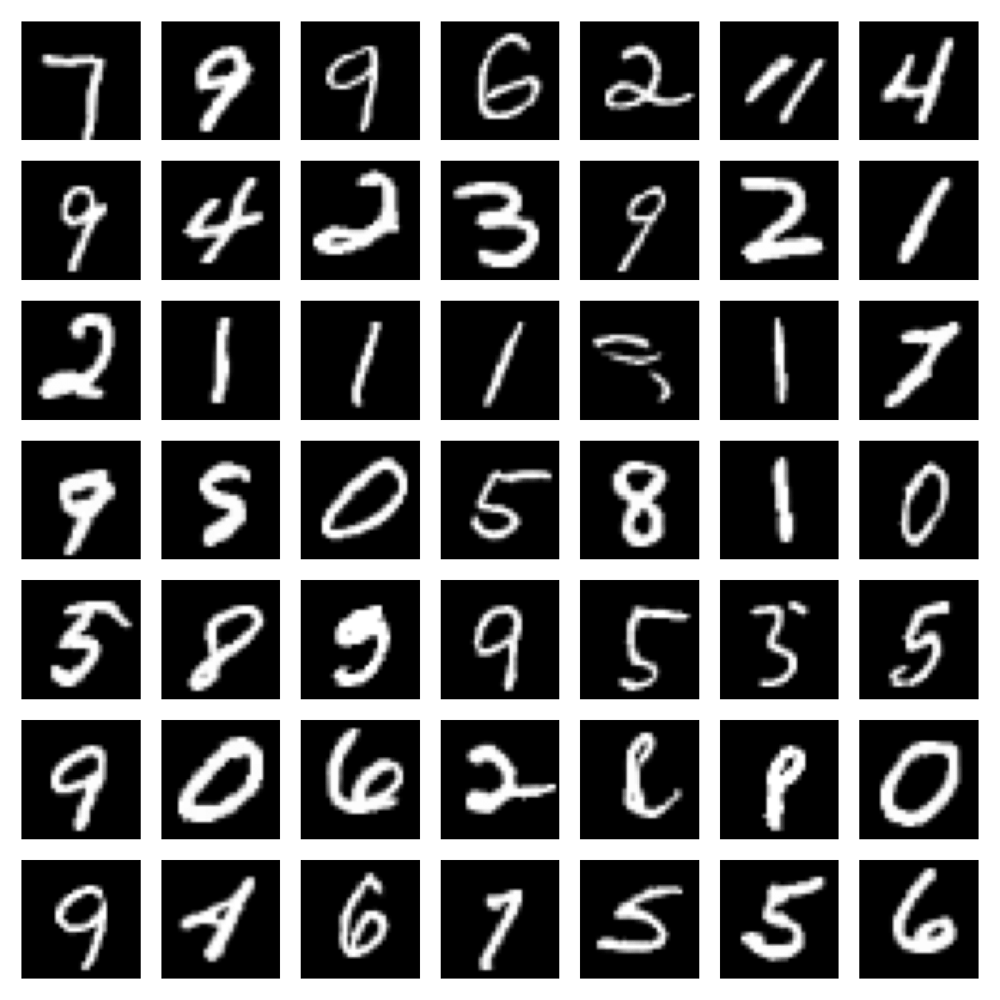
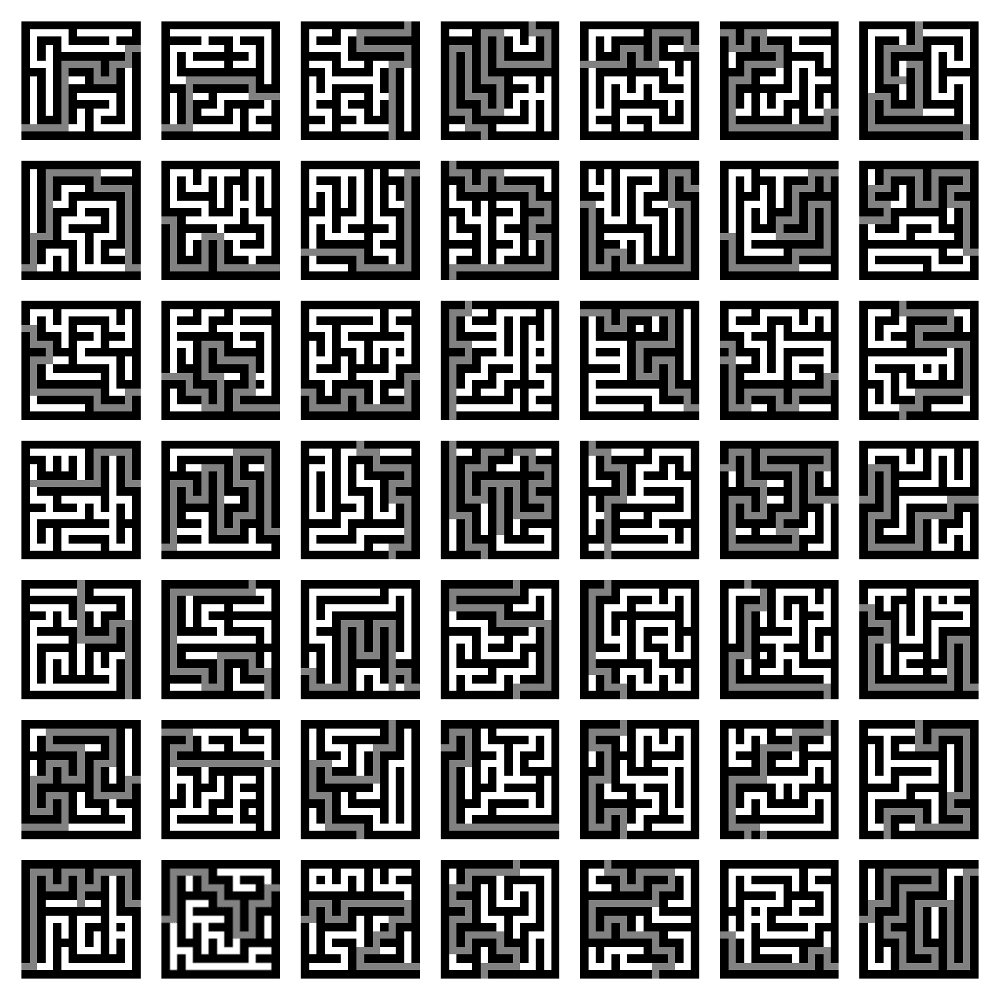

# Discrete-Time Diffusion Models for Discrete Data

[](https://github.com/paulffm/Discrete-Time-Diffusion-Models-for-Discrete-Data/blob/main/LICENSE)

Unofficial **PyTorch** reimplementations of the
papers [Structured Denoising Diffusion Models in Discrete State-Spaces](https://arxiv.org/pdf/2107.03006)
by J. Austin et al. and [Argmax Flows and Multinomial Diffusion: Learning Categorical Distributions](https://arxiv.org/abs/2102.05379)
by E. Hoogeboom et al.

<p align="center">
  
</p>

## Installation

Follow these steps to clone the repository and install the dependencies:

### 1. Clone the repository

Clone the repository using the following command:

```sh
git clone https://github.com/paulffm/Discrete-Time-Diffusion-Models-for-Discrete-Data.git
cd Discrete-Time-Diffusion-Models-for-Discrete-Data
```

### 2. Create a virtual environment

Create a virtual environment to install dependencies in isolation:

```sh
python -m venv myvenv
source myvenv/bin/activate  # On Windows use `myvenv\Scripts\activate`
```

### 3. Install dependencies

Install the necessary dependencies using pip:

```sh
pip install -r requirements.txt
```

## Usage

This implementation provides an example script for training D3PM models to generate MNIST data or maze data. In this script you can simply use my provided configs and start training or retraining your models. You just need to set the correct paths in the beginning of the script, i.e.:

```python
def main():

    script_dir = os.path.dirname(os.path.realpath(__file__))
    save_location = os.path.join(script_dir, f"SavedModels/MNIST/")
    save_location_png = os.path.join(save_location, "PNGs/")
    dataset_location = os.path.join(script_dir, 'lib/datasets')

    train_resume = False
    print(save_location)
    if not train_resume:
        cfg = get_config()
        bookkeeping.save_config(cfg, save_location)

    else:
        model_name = "model_name.pt"
        date = "2024-05-10"
        config_name = "config_001.yaml"
        config_path = os.path.join(save_location, date, config_name)
        cfg = bookkeeping.load_config(config_path)
```
In addition, you need to set a location in the config files where you want to save you trained models:
```python
save_directory = "SavedModels/MNIST/"
```
## Note
Infos to the maze dataset and the corresponding sample quality metrics can be found here.

## Results
D3PM results on MNIST: FID: 1.88; Inception Score: 8.6

<p align="center">
  
</p>

D3PM results on maze dataset: Accuracy: 85%; Hellinger Distance: 0.0709

<p align="center">
  
</p>

## Reference

```bibtex
@article{austin2021structured,
  title={Structured denoising diffusion models in discrete state-spaces},
  author={Austin, Jacob and Johnson, Daniel D and Ho, Jonathan and Tarlow, Daniel and Van Den Berg, Rianne},
  journal={Advances in Neural Information Processing Systems},
  volume={34},
  pages={17981--17993},
  year={2021}
}
@article{hoogeboom2021argmax,
  title={Argmax flows and multinomial diffusion: Learning categorical distributions},
  author={Hoogeboom, Emiel and Nielsen, Didrik and Jaini, Priyank and Forr{\'e}, Patrick and Welling, Max},
  journal={Advances in Neural Information Processing Systems},
  volume={34},
  pages={12454--12465},
  year={2021}
}
```
