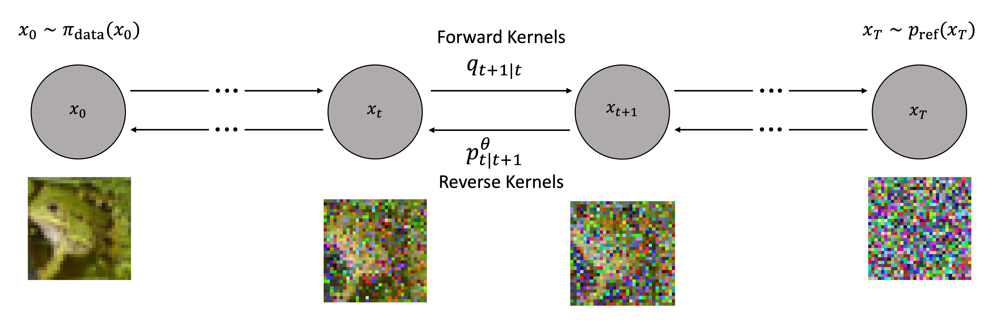

# Discrete-Time Diffusion Models for Discrete Data

[](https://github.com/paulffm/Dirichlet-Diffusion-Score-Model-Reimplementation/blob/main/LICENSE)

Unofficial **PyTorch** reimplementations of the
papers [Structured Denoising Diffusion Models in Discrete State-Spaces](https://arxiv.org/pdf/2107.03006)
by J. Austin et al. and [Argmax Flows and Multinomial Diffusion: Learning Categorical Distributions](https://arxiv.org/abs/2102.05379)
by E. Hoogeboom et al.

<p align="center">
  
</p>


## Usage

This implementation provides example notebooks for training and evaluation of DDSM models for Bin-MNIST and MNIST data. In these notebooks you can simply load our provided configs and start training or retraining your models with them as follows:

```python
import os
from lib.models.networks import MNISTScoreNet
import lib.utils.bookkeeping as bookkeeping
from lib.config.config_bin_mnist import get_config

train_resume = False
train_resume_path = 'path/to/saved/models'

if not train_resume:
    config = get_config()
    bookkeeping.save_config(config, config.saving.save_location)

else:
    path = train_resume_path
    date = "date"
    config_name = "config_001.yaml"
    config_path = os.path.join(path, date, config_name)
    config = bookkeeping.load_config(config_path)

model = MNISTScoreNet(ch=config.model.ch, ch_mult=config.model.ch_mult, attn=config.model.attn, num_res_blocks=config.model.num_res_blocks, dropout=0.1, time_dependent_weights=time_dependent_weights)
print("Number of parameters: ", sum([p.numel() for p in model.parameters()]))
optimizer = Adam(model.parameters(), lr=config.optimizer.lr, weight_decay=config.optimizer.weight_decay)
n_iter = 0
state = {"model": model, "optimizer": optimizer, "n_iter": 0}

if train_resume:
    checkpoint_path = config.saving.checkpoint_path
    model_name = 'model_name.pt'
    checkpoint_path = os.path.join(path, date, model_name)
    state = bookkeeping.load_state(state, checkpoint_path, device)
    config.training.n_iter = 100000
    config.sampler.sampler_freq = 5000
    config.saving.checkpoint_freq = 1000

```
Further, I provided a notebook to presample noise and speed up the computation.

## Note
I additionally included the U-Net model from paper [Structured Denoising Diffusion Models in Discrete State-Spaces](https://arxiv.org/pdf/2107.03006.pdf) which could be more suitable to the MNIST dataset.

## Reference

```bibtex
@article{austin2021structured,
  title={Structured denoising diffusion models in discrete state-spaces},
  author={Austin, Jacob and Johnson, Daniel D and Ho, Jonathan and Tarlow, Daniel and Van Den Berg, Rianne},
  journal={Advances in Neural Information Processing Systems},
  volume={34},
  pages={17981--17993},
  year={2021}
}
@article{hoogeboom2021argmax,
  title={Argmax flows and multinomial diffusion: Learning categorical distributions},
  author={Hoogeboom, Emiel and Nielsen, Didrik and Jaini, Priyank and Forr{\'e}, Patrick and Welling, Max},
  journal={Advances in Neural Information Processing Systems},
  volume={34},
  pages={12454--12465},
  year={2021}
}
```